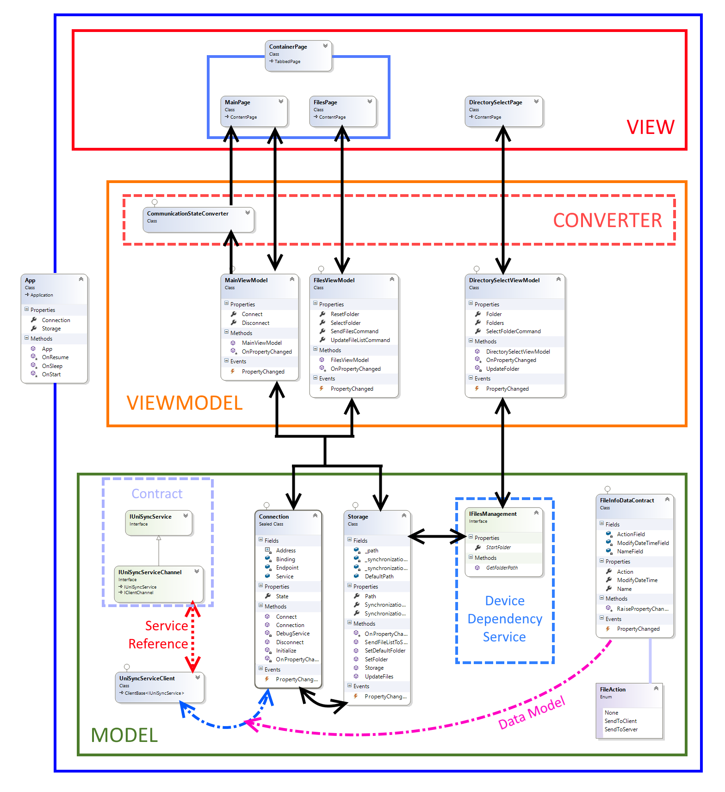

# Description

UniSync is one of my biggest projects so far. The main idea is to introduce new generation and full-featured synchronization app available for many platforms. The core of project is WCF service server app that is controlling entire system build of mobile and desktop clients.

# Screenshots

> TODO: Make some screenshots of app.

# Documentation

The best part of entire project is technical documentation available in Polish language. It contains all explanations of used technologies, frameworks and libraries (with precise comparison) as well as project overview, implemented and not implemented features with descriptive annotaions.

## Class Diagram

